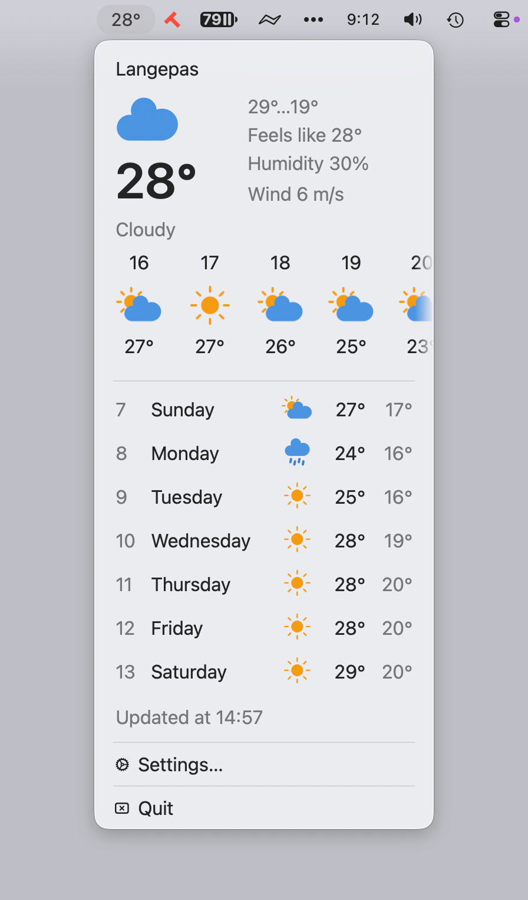

  

# Cluudo

Cluudo is a small native macOS menu bar weather app. It shows the current conditions, an hourly outlook, and a multi-day forecast without requiring an API key. I made this app for myself—I really wanted to have just the date number in the menu bar.

## Features

- Current temperature and weather conditions in the menu bar
- Hourly and daily forecasts
- City search or IP-based approximate location
- Celsius/Fahrenheit and wind unit preferences
- Optional precipitation notifications
- Color and monochrome weather icons

## Screenshot

## Installation

- Download the latest DMG file from the [releases page](https://github.com/yurastegny/cluudo/releases)
- Open the DMG file
- Drag the Cluudo app to your Applications folder
- Launch Cluudo — it appears in the menu bar

### How to run

Right now, in my region it's not possible to get an Apple Developer account. Without it, Apple does not trust the app. But you can open it using the following method:

1. Try to open the app by double-clicking it — you'll see a warning:
**"Cluudo" can't be opened because the developer cannot be verified**.
2. Open **System Settings** → in the sidebar, click **Privacy & Security**.
3. Scroll down to the **Security** section.
4. You'll see a message like:
**"Cluudo" was blocked from use because it is not from an identified developer**.
Next to it, there will be a button "**Open Anyway**" (sometimes just "**Open**").
5. Click "**Open Anyway**".
6. Enter your administrator password, then confirm by clicking "**Open**".

After this, the app will be added to the exceptions list and will launch normally.

## Requirements

- macOS 13 or later
- Xcode 16 or later

## Data and privacy

Cluudo contacts the following services directly:

- [MET Norway](https://api.met.no/) for weather forecasts
- [Open-Meteo](https://open-meteo.com/) for city search
- [Nominatim](https://nominatim.openstreetmap.org/) for reverse geocoding
- [ipapi](https://ipapi.co/) only when automatic location is enabled

Requests expose the user's IP address to those providers. Automatic location uses an IP-derived approximate city and coordinates; Cluudo does not request macOS precise-location permission.

Forecast data from MET Norway is transformed for display by Cluudo. See `THIRD_PARTY_NOTICES.md` for attribution and licensing information.

## License

Cluudo is available under the [MIT License](LICENSE).
